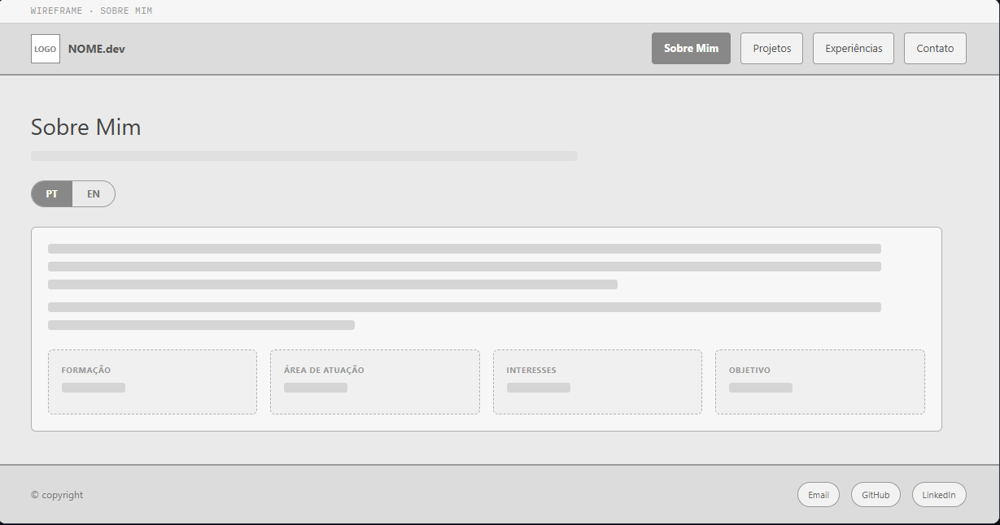
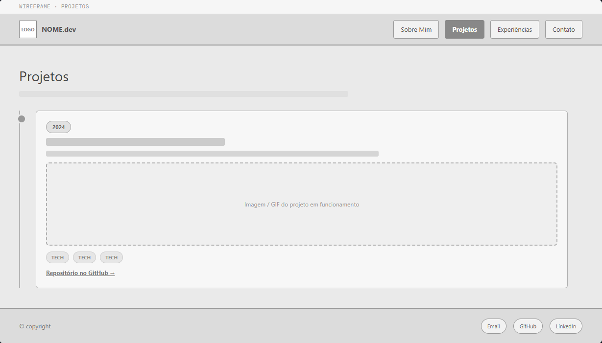
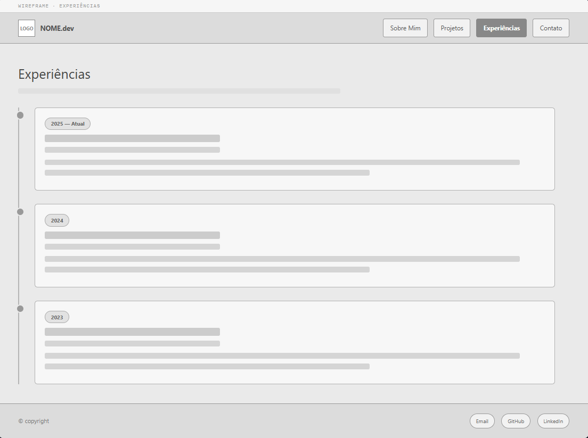
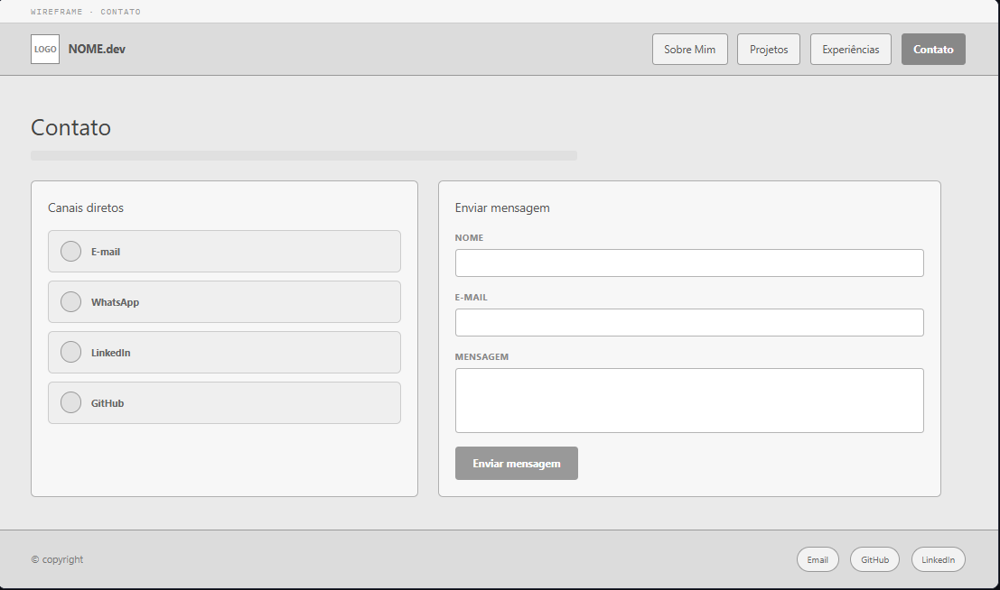
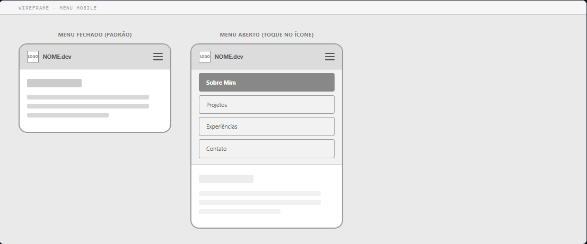
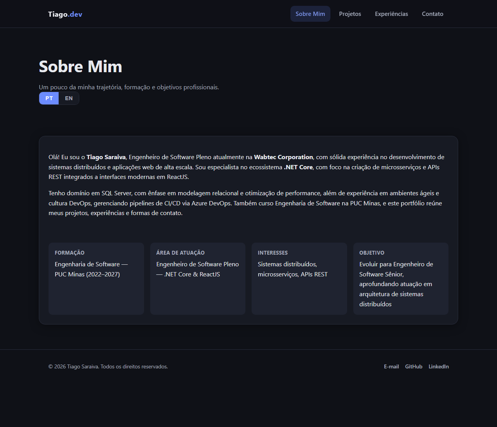
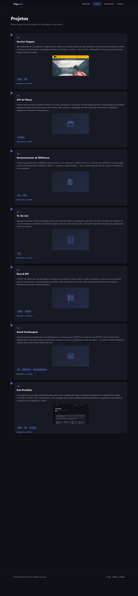
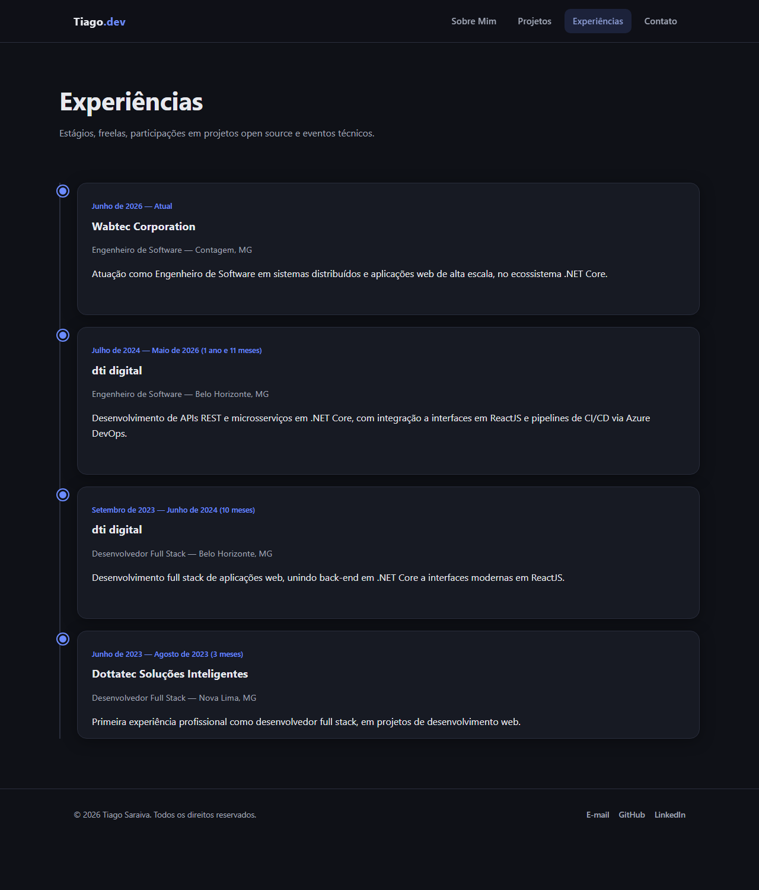
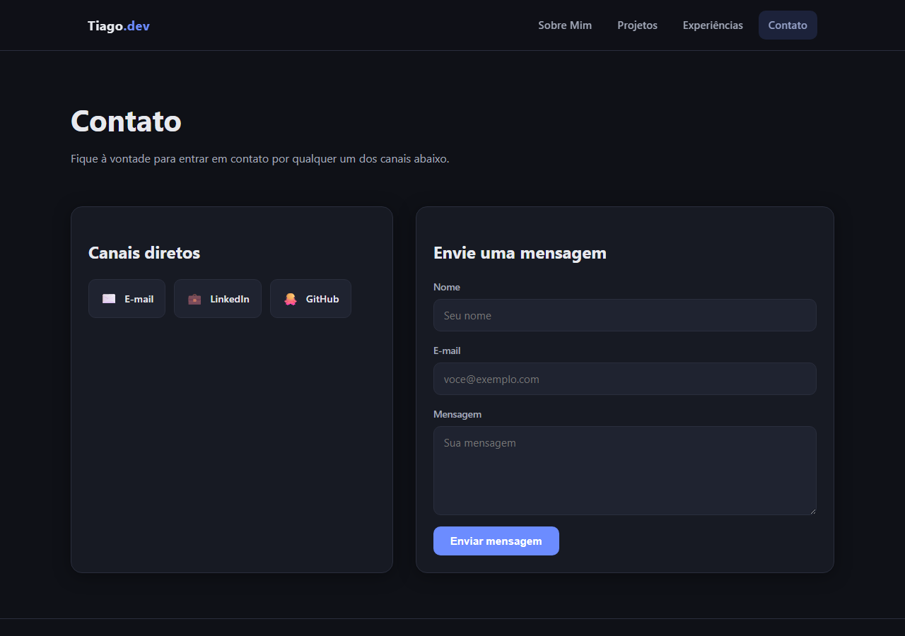

# Portfólio Profissional — Tiago Saraiva

Website de portfólio profissional desenvolvido para a disciplina **Projeto de Software**
(Engenharia de Software — PUC Minas), Laboratório 1, Segundo Semestre/2026.

> Projeto em desenvolvimento — entrega atual: **Lab01S02** (implementação das funcionalidades principais).

## Sobre o projeto

O site apresenta minha trajetória, habilidades, projetos e formas de contato, organizados em
quatro seções acessadas por um menu de navegação:

- **Sobre Mim** — apresentação em português e inglês (com botão de troca de idioma).
- **Projetos** — linha do tempo de projetos, do mais antigo ao mais recente.
- **Experiências** — trajetória profissional, do vínculo mais recente ao mais antigo.
- **Contato** — ícones para e-mail/WhatsApp/LinkedIn/GitHub e formulário de contato.

## Wireframes

Wireframes de média fidelidade das 4 seções, em escala de cinza (foco em estrutura e
navegação, não no visual final):

| Sobre Mim                                          | Projetos                                            |
| --------------------------------------------------- | ---------------------------------------------------- |
|       |          |

| Experiências                                              | Contato                                          |
| ------------------------------------------------------------ | --------------------------------------------------- |
|         |           |

**Comportamento responsivo (menu mobile):**

## Estrutura Inicial

Navegação e layout principal (cabeçalho, rodapé, área de conteúdo) implementados e
funcionando nas 4 páginas, com conteúdo real: bio e experiências profissionais reais, e 7
projetos reais do GitHub (com screenshot real dos que têm front-end, e ilustração nos que
não têm). As timelines de Projetos e Experiências são renderizadas dinamicamente via
JavaScript a partir de um array de dados em `js/main.js`. Único item ainda placeholder: o
número de WhatsApp em `contato.html`.

| Sobre Mim                                      | Projetos                                         |
| ---------------------------------------------- | ------------------------------------------------ |
|  |  |

| Experiências                                             | Contato                                        |
| -------------------------------------------------------- | ---------------------------------------------- |
|  |  |

## Tecnologias utilizadas

- **HTML5** — estrutura semântica das páginas.
- **CSS3** — estilização, layout responsivo (Flexbox/Grid), variáveis de tema.
- **JavaScript (Vanilla)** — navegação (menu mobile, link ativo), toggle de idioma PT/EN,
  renderização dinâmica das timelines (Projetos/Experiências) e validação do formulário.
- **[EmailJS](https://www.emailjs.com/)** — envio do formulário de contato direto do
  navegador, sem back-end (carregado via CDN em `contato.html`).

Nenhum framework/build tool é necessário — o site é HTML/CSS/JS estático puro, o que também
simplifica o deploy gratuito em serviços como GitHub Pages, Vercel ou Render.

## Configurar o envio de e-mail (EmailJS)

O formulário de contato usa o [EmailJS](https://www.emailjs.com/) para enviar e-mails
direto do navegador. Sem configurar suas chaves, o formulário valida os campos mas mostra
um aviso de que o envio ainda não está disponível.

1. Crie uma conta gratuita em [emailjs.com](https://www.emailjs.com/) (plano free: 200
   e-mails/mês).
2. Conecte um serviço de e-mail (Gmail, Outlook, etc.) em **Email Services** — isso gera um
   **Service ID**.
3. Crie um template em **Email Templates** com variáveis `{{name}}`, `{{email}}` e
   `{{message}}` — isso gera um **Template ID**.
4. Copie sua **Public Key** em **Account → General**.
5. Cole os três valores em [js/email-config.js](js/email-config.js), no lugar dos
   placeholders `COLOQUE_AQUI_...`.
